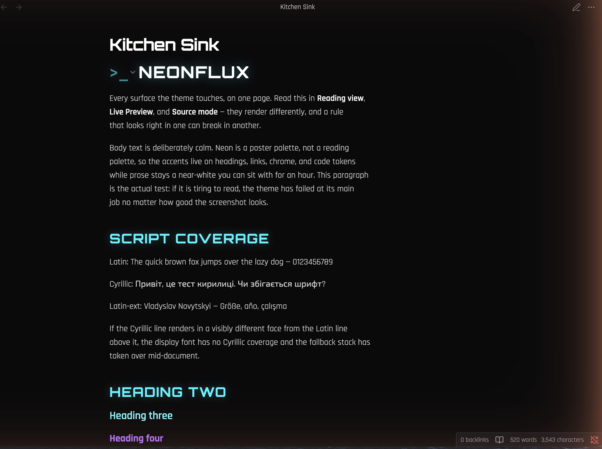

# Neonflux

An Obsidian theme. Neon on near-black, machined edges, Orbitron headings over
a `>_` prompt. Light mode included and not an afterthought.

Palette shared with [`@laddtnov/cyberpunk-ui`](https://github.com/laddtnov/cyberpunk-ui).



## What it is

A neon-on-near-black theme for people who read in Obsidian for hours, built so
the aesthetic does not cost legibility:

- **Accents stay on short strings.** Headings, links, chrome, code tokens. Body
  text is a calm near-white — neon is a poster palette, not a reading palette.
- **Glow never touches text you read.** Only `h1` and `h2` carry it. A
  text-shadow under a paragraph is a legibility bug in costume.
- **Light mode is not an afterthought.** The neon hues are unusable on white
  (cyan measures about 1.2:1), so they are replaced with dimmed equivalents
  that clear WCAG AA.
- **Contrast is enforced, not asserted.** A checker runs over both themes and
  fails the build on regression, holding muted text and syntax colours to the
  4.5:1 *text* floor rather than the 3.0 non-text one.
- **Six fonts embedded, Latin and Cyrillic.** Nothing is fetched at launch.
- **Zero JavaScript.** Built by remapping Obsidian's own design tokens, so it
  reaches plugins and survives app updates.

## Install

Not yet in the community themes list. To try it now:

```sh
git clone https://github.com/laddtnov/Neonflux
cd Neonflux
npm run build
scripts/install-dev.sh /path/to/your/vault
```

Then pick it in Settings → Appearance → Themes.

## Development

`src/theme.css` is the file a human edits. `theme.css` at the repo root is a
build artifact — fonts prepended to the source — and is what Obsidian loads.

```sh
npm run build           # src/theme.css + fonts -> theme.css
npm run check:contrast  # WCAG check, both themes
npm run dev             # build, then install into demo-vault/
npm run build:fonts     # re-download and re-inline the fonts (rarely needed)
npm run release 0.2.0   # bump, verify, tag, publish
```

### Releasing

Use `npm run release`, not `npm version`. **The tag must equal the
`manifest.json` version exactly, with no `v` prefix.** Obsidian's community
theme bot installs assets from the release whose tag matches the manifest, and
rejects `v0.1.0` against a manifest saying `0.1.0` with *"No release matches
your manifest version"*. The sibling `cyberpunk-ui` repo uses `npm version`,
which tags *with* a `v` — carrying that habit here breaks the listing, which
is exactly why this repo has its own script.

The script refuses to publish if the branch isn't `main`, the tag already
exists, the tree is dirty, local and origin have diverged, the contrast check
fails, or `theme.css` is stale relative to its sources. Release notes come
from `docs/release-notes/<version>.md` if present, otherwise from the commits.

`demo-vault/` is a throwaway vault whose single note exercises every surface
the theme touches. Open it in Obsidian and reload with `Cmd-R` after a build.

### How it is built

Almost entirely by **remapping Obsidian's own design tokens** rather than
overriding its rules. Token remapping survives app updates and reaches
community plugins for free; rule overrides break on both counts. The handful
of real rules each carry a comment explaining why a token could not do the
job.

Setting `--accent-h/s/l` and the `--color-base-*` ramp is what makes the theme
reach surfaces no rule here mentions — sliders, toggles, callouts, the graph.

### Fonts

Six faces are **embedded as base64 woff2**, not linked from a CDN. Obsidian is
offline-first: a theme that fetches fonts on every launch leaks the user's IP
to a third party and stalls startup without a connection.

| Role | Latin | Cyrillic |
| --- | --- | --- |
| Headings | Orbitron | Unbounded |
| Body and UI | Rajdhani | Exo 2 |
| Code | Share Tech Mono | JetBrains Mono |

The three Latin faces have no Cyrillic at all, so each is paired with a
companion chosen to match its character. **Font fallback is per-glyph**, so
the stacks alone do the work — no `unicode-range` rules, no JavaScript. The
companions ship their Cyrillic subsets only, so no Latin glyph is embedded
twice.

All six are SIL Open Font License 1.1, which permits this redistribution.
Licence text in [`fonts/OFL.txt`](fonts/OFL.txt).

## Accessibility

Contrast is enforced by `scripts/check-contrast.js`, with floors stricter than
the sibling CSS kit uses: muted text and syntax colours are held to 4.5:1, not
3.0, because a note-taking app is read for hours and a code comment is text
somebody parses.

[`ACCESSIBILITY.md`](ACCESSIBILITY.md) records what passes, what was fixed,
and — more usefully — the three known problems that remain, including the
Cyrillic gap and the screen-reader announcement of the `>_` prompt.

## Licence

Two licences, because `theme.css` is a combined work.

**The theme** — everything in `src/`, `scripts/`, and the documentation — is
**MIT**. See [`LICENSE`](LICENSE).

**The six embedded fonts** are **SIL Open Font License 1.1**, which is what
permits bundling them here. The OFL is not MIT: notably it forbids selling the
fonts on their own, and it requires the copyright notices to travel with the
font data. Those notices are reproduced in full at the top of the built
`theme.css` — not merely linked — because Obsidian installs `theme.css` and
`manifest.json` alone, so a link would leave every installed copy carrying
font binaries with no notice attached. The complete licence text is in
[`fonts/OFL.txt`](fonts/OFL.txt) and ships as an asset on every release.

| Font | Copyright |
| --- | --- |
| Orbitron | The Orbitron Project Authors (Reserved Font Name: "Orbitron") |
| Rajdhani | Indian Type Foundry |
| Share Tech Mono | Carrois Type Design, Ralph du Carrois (RFN: 'Share') |
| Unbounded | The Unbounded Project Authors |
| Exo 2 | The Exo 2 Project Authors |
| JetBrains Mono | The JetBrains Mono Project Authors |

The woff2 files are Google Fonts' subsets, redistributed unmodified and under
their original family names.

Obsidian is a trademark of Dynalist Inc. This theme is not affiliated with or
endorsed by them; the name is used only to say what the theme is for.
